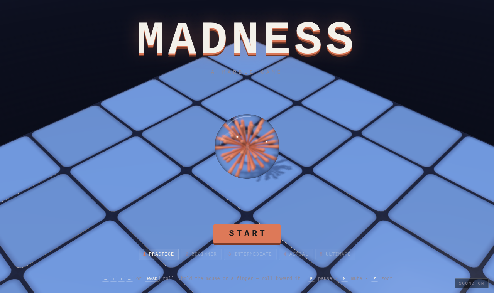
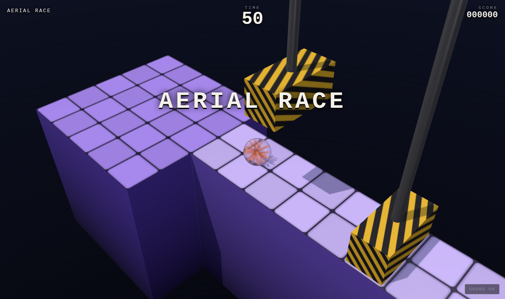

# Madness

A Marble Madness-style 3D racer. You roll a glass marble down courses that hang
in the dark, with a single clock running against you. You can roll off the
edges, drop too far, get flattened by a hammer or dissolved by acid, and get
shoved off by black steelies along the way. Whatever time is left at a goal
carries over into the next race.

The marble is [Alan](https://github.com/h1ddenpr0cess20/alan)'s eye: the same
sphere of clear glass, drawn by the same engine. Where Alan has an iris, the
marble has the Claude spark made three-dimensional: a burst of terracotta
strands out every way from the middle, each one fuller toward its rounded tip.
It tumbles inside the glass as the marble rolls.





## Run

```sh
git clone https://github.com/h1ddenpr0cess20/madness
cd madness
npm install
npm run dev               # → http://localhost:5173
```

No server and no keys: it's a static page. `npm run build` puts it in `dist/`,
which runs from any folder or path.

## Play

| | |
|---|---|
| <kbd>←</kbd><kbd>↑</kbd><kbd>↓</kbd><kbd>→</kbd> or <kbd>WASD</kbd> | Roll. The courses run diagonally across the screen, so hold two at once. |
| Hold the mouse or a finger | Roll toward the pointer. The further it is from the marble, the harder the push. |
| Gamepad | Left stick or d-pad; <kbd>A</kbd> starts, <kbd>Start</kbd> pauses. |
| <kbd>P</kbd> / <kbd>Esc</kbd> | Pause. |
| <kbd>Z</kbd> | Zoom in closer to the marble, and back out. |
| <kbd>M</kbd> | Sound on or off. |

There are five races: Practice, Beginner, Intermediate, Aerial and Ultimate.
Each one adds its own time to whatever you had left. Losing the marble puts it
back on the last safe ground it crossed while the clock keeps running, so a
fall costs a couple of seconds and nothing more. The title screen lets you
start from any race you have reached before, and it keeps your best score.

What's out there:

- **Drops.** A long fall onto flat ground breaks the marble. Coming down at a
  glance onto a slope doesn't.
- **Steelies.** Heavy black marbles that come for you and try to knock you off
  the edge.
- **Acid slimes.** Green blobs that creep round set paths. Touch one and the
  marble is gone.
- **Hammers.** They climb slowly, wait at the top, then slam down.
- **Lifts.** They carry you across gaps and down shafts, and pause at each end
  for you to get on or off.

## How it's made

| | |
|---|---|
| `src/vendor/gfx/` | Alan's renderer, copied unchanged from `alan/src/client/vendor/gfx`: WebGPU where the browser has it, WebGL 2 where it doesn't (`?renderer=webgl` pins it), physically based shading, transmission and shadows. |
| `src/marble.js` | Alan's glass (`createEye`), scaled down to a marble, with the 3D spark inside it. |
| `src/course.js` | A course is a grid of tiles, each with four corner heights. That one structure gives flat ground, ramps, banks, half-pipes and bumps, with walls wherever neighbouring tiles differ. It builds both the mesh and the collision triangles. |
| `src/levels.js` | The five races, written with `flat`, `slope`, `surface` and the hazards. |
| `src/physics.js` | Sphere physics written for this game: gravity, the push from the controls, then contact resolution against the triangles and the moving boxes, nearest contact first so seams between tiles don't nudge the marble. |
| `src/race.js` | One race with nothing drawn: the rules for losing the marble, reaching the goal and where it goes back to. The game draws it; the tests drive it. |
| `src/audio.js` | Every sound, synthesised with Web Audio. |

| Script | |
|---|---|
| `npm run dev` | Vite dev server |
| `npm run build` | Bundles to `dist/` |
| `npm run preview` | `build`, then serves `dist/` |
| `npm test` | `node:test`: the physics, the course builder, the hazards, the marble, and an autopilot that has to finish every race well inside its time without losing the marble |
| `npm run lint` | ESLint |

The renderer is three.js-shaped but isn't three.js; see
`src/vendor/gfx/LICENSE` for what it ports from it.
